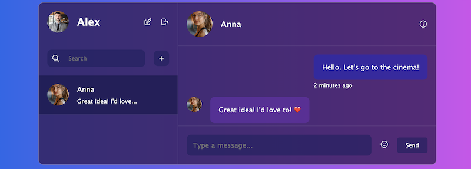

# Express React Chat Application

This is a modern chat application built with Express.js, React, and Socket.IO. The project consists of three main components: the backend, the client, and the socket server. The application supports user registration, real-time messaging, emoji support, profile management, and more.

## Overview

The Express React Chat Application is designed to provide a seamless and interactive messaging experience. It features a backend service that handles user authentication and API endpoints, a frontend client built with React for user interaction, and a socket server to manage real-time communication.

## Features

- **User Registration and Login:** Users can sign up and log in using their email and password.
- **Real-Time Messaging:** Supports sending and receiving messages instantly.
- **Emojis:** Allows users to send emojis in their chat messages.
- **Profile Management:** Users can edit their personal information and view profiles of other users.
- **Scalability:** Built to handle multiple concurrent connections with ease.

## Technological Description

### Backend

- **Express.js:** Provides the server-side logic for user authentication and API routing.
- **Prisma:** Used for database management and interaction.
- **MongoDB:** Serves as the primary database for storing and managing data.
- **TypeScript:** Ensures type safety and maintainable code.

### Client

- **React:** Handles the user interface and interactions.
- **Vite:** A fast build tool for modern web applications.
- **TypeScript:** Adds type definitions for enhanced code quality.

### Socket Server

- **Socket.IO:** Manages real-time, bidirectional communication between users.
- **TypeScript:** Provides static typing for better development experience.

## Preparing the Project for Deployment

To deploy the Express React Chat Application, follow these steps:

1. **Clone the Repository:**

   ```bash
   git clone https://github.com/codedevbox/express-react-socket-chat.git
   ```

   ```bash
   cd express-react-socket-chat
   ```

2. **Install Dependencies:**

   _Backend (API):_

   ```bash
   cd api
   npm install
   npm run build
   npm start
   ```

   _Client:_

   ```bash
   cd ../client
   npm install
   npm run build
   npm run preview
   ```

   _Socket Server:_

   ```bash
   cd ../socket
   npm install
   npm run build
   npm start
   ```

## License

This project is licensed under the ISC License.

## Contact

For any questions or feedback, feel free to contact us at codedevbox@gmail.com.
